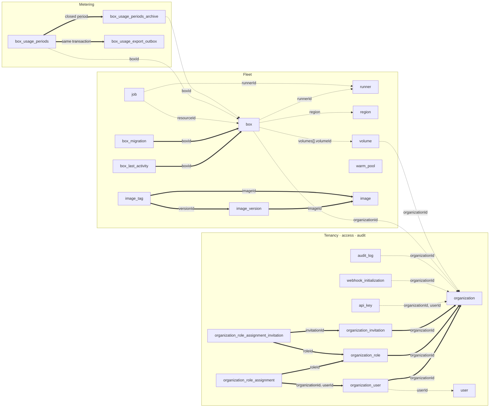

# BoxLite application data model

This catalog describes the durable state owned by the applications in this
directory: the control-plane Postgres schema, and the satellite stores that
sit beside it. Each table entry names its columns, its keys, and the
constraints and indexes the database actually enforces.

The model is implementation-grounded:

- Tables and columns come from the TypeORM entities under
  [`api/src`](./api/src). The data source globs every `*.entity.ts` in that
  tree (see [`data-source.ts`](./api/src/migrations/data-source.ts)), so the
  entity files are the complete list of mapped tables.
- Column types, constraints, and index definitions come from the migrations in
  [`api/src/migrations`](./api/src/migrations/): the baseline
  `1741087887225-migration.ts` creates 17 tables, and the
  [`pre-deploy`](./api/src/migrations/pre-deploy/) set adds 7 more.
- Satellite stores come from [`dex/config.yaml`](./dex/config.yaml),
  [`otel-collector/config.yaml`](./otel-collector/config.yaml), and the
  ClickHouse queries in
  [`box-telemetry`](./api/src/box-telemetry/services/box-telemetry.service.ts).

`apps/api` is the only application that owns a database. The Go services —
[`runner`](./runner/) and [`proxy`](./proxy/) — hold no persistence: neither
imports an ORM, `database/sql`, or an embedded store. Runner state reaches the
control plane only through `runner` telemetry columns and `job` results.

## Overview

The 24 tables sort into three planes. **Tenancy** is who a caller is and what
they may do; **fleet** is the microVMs and the machines that run them;
**metering** is what gets billed.

Thick edges are foreign keys the database enforces. Dashed edges are
references the application enforces alone. `warm_pool` references nothing: a
box request is matched against the pool by shape, not by id.

## Referential integrity

The schema declares **12 foreign keys across 24 tables**. All of them live
inside the tenancy cluster, on the two tables owned outright by a box, or
inside the image catalog.
Every edge that crosses a plane boundary — including `box.organizationId`,
the most widely joined column in the system — is a bare `uuid` or
`character varying` column with no constraint behind it.

The practical consequence: deleting an `organization` row cascades its roles,
users, invitations, and role assignments, and leaves its boxes, API
keys, audit entries, regions, volumes, and usage history pointing at an id
that no longer resolves.

| From                                     | Column(s)                    | To                             | Enforcement | On delete |
| ---------------------------------------- | ---------------------------- | ------------------------------ | ----------- | --------- |
| `organization_user`                      | `organizationId`             | `organization.id`              | foreign key | `CASCADE` |
| `organization_role`                      | `organizationId`             | `organization.id`              | foreign key | `CASCADE` |
| `organization_invitation`                | `organizationId`             | `organization.id`              | foreign key | `CASCADE` |
| `organization_role_assignment`           | `organizationId`, `userId`   | `organization_user` (PK)       | foreign key | `CASCADE` |
| `organization_role_assignment`           | `roleId`                     | `organization_role.id`         | foreign key | `NO ACTION` |
| `organization_role_assignment_invitation`| `invitationId`               | `organization_invitation.id`   | foreign key | `CASCADE` |
| `organization_role_assignment_invitation`| `roleId`                     | `organization_role.id`         | foreign key | `NO ACTION` |
| `box_last_activity`                      | `boxId`                      | `box.id`                       | foreign key | `CASCADE` |
| `box_migration`                          | `boxId`                      | `box.id`                       | foreign key | `CASCADE` |
| `image_version`                          | `imageId`                    | `image.id`                     | foreign key | `CASCADE` |
| `image_tag`                              | `imageId`                    | `image.id`                     | foreign key | `CASCADE` |
| `image_tag`                              | `versionId`                  | `image_version.id`             | foreign key | `RESTRICT` |
| `organization_user`                      | `userId`                     | `user.id`                      | application | — |
| `api_key`                                | `organizationId`, `userId`   | `organization.id`, `user.id`   | application | — |
| `webhook_initialization`                 | `organizationId`             | `organization.id`              | application | — |
| `audit_log`                              | `organizationId`             | `organization.id`              | application | — |
| `audit_log`                              | `targetType`, `targetId`     | any table                      | application | polymorphic, untyped |
| `region`                                 | `organizationId`             | `organization.id`              | application | null for shared regions |
| `image`                                  | `organizationId`             | `organization.id`              | application | never null |
| `organization`                           | `defaultRegionId`            | `region.id`                    | application | — |
| `volume`                                 | `organizationId`             | `organization.id`              | application | — |
| `box`                                    | `organizationId`             | `organization.id`              | application | — |
| `box`                                    | `region`                     | `region.id`                    | application | holds the id, not the name |
| `box`                                    | `runnerId`, `prevRunnerId`   | `runner.id`                    | application | nulled on destroy/archive |
| `box`                                    | `volumes[].volumeId`         | `volume.id`                    | application | jsonb array, GIN-indexed |
| `box_migration`                          | `runnerId`                   | `runner.id`                    | application | the migration's second runner |
| `runner`                                 | `region`                     | `region.id`                    | application | — |
| `job`                                    | `runnerId`                   | `runner.id`                    | application | — |
| `job`                                    | `resourceType`, `resourceId` | `box.id`                       | application | polymorphic across resource types |
| `box_usage_periods`                      | `boxId`, `organizationId`    | `box.id`, `organization.id`    | application | org id denormalized for billing |
| `box_usage_periods_archive`              | `boxId`, `organizationId`    | `box.id`, `organization.id`    | application | — |

### Invariants held by partial unique indexes

Four correctness properties are enforced by the database rather than by
application locking. The per-box Redis locks are advisory and expire, so an
interleaved pair of handlers could otherwise violate all four.

| Index                                          | Table               | Definition                                              |
| ---------------------------------------------- | ------------------- | ------------------------------------------------------- |
| `box_usage_periods_one_open_period_per_box_idx` | `box_usage_periods` | unique `("boxId")` where `"endAt" IS NULL`              |
| `IDX_UNIQUE_INCOMPLETE_JOB`                    | `job`               | unique `("resourceType","resourceId","runnerId")` where `"completedAt" IS NULL` |
| `organization_user_default_user_unique`        | `organization_user` | unique `("userId")` where `"isDefaultForUser" = true`   |
| `image_org_name_active_unique`                 | `image`             | unique `("organizationId","name")` where `"deletedAt" IS NULL` |

## Tenancy, access and audit

### `organization`

The tenant. Carries per-box resource ceilings, rate limits, and suspension
state inline.

| Column | Type | Notes |
| ------ | ---- | ----- |
| `id` | `uuid` | primary key |
| `name` | `character varying` | |
| `createdBy` | `character varying` | |
| `telemetryEnabled` | `boolean` | default `true` |
| `defaultRegionId` | `character varying` | nullable; references `region.id` |
| `max_cpu_per_box` | `integer` | default `4` |
| `max_memory_per_box` | `integer` | default `8` |
| `max_disk_per_box` | `integer` | default `10` |
| `authenticated_rate_limit` | `integer` | nullable |
| `box_create_rate_limit` | `integer` | nullable |
| `box_lifecycle_rate_limit` | `integer` | nullable |
| `authenticated_rate_limit_ttl_seconds` | `integer` | nullable |
| `box_create_rate_limit_ttl_seconds` | `integer` | nullable |
| `box_lifecycle_rate_limit_ttl_seconds` | `integer` | nullable |
| `suspended` | `boolean` | default `false` |
| `suspendedAt` | `timestamptz` | nullable |
| `suspendedUntil` | `timestamptz` | nullable |
| `suspensionReason` | `character varying` | nullable |
| `suspensionCleanupGracePeriodHours` | `integer` | default `24` |
| `image_count_limit` | `integer` | default `20`; catalog entries an organization may keep |
| `boxLimitedNetworkEgress` | `boolean` | default `false` |
| `experimentalConfig` | `jsonb` | nullable |
| `createdAt` / `updatedAt` | `timestamptz` | |

### `user`

Identity, keyed by the subject the IdP issues rather than a generated uuid.

| Column | Type | Notes |
| ------ | ---- | ----- |
| `id` | `character varying` | primary key |
| `name` | `character varying` | |
| `email` | `character varying` | default `''` |
| `emailVerified` | `boolean` | default `false` |
| `role` | `enum` | `admin` \| `user`, default `user` |
| `publicKeys` | `simple-json` | |
| `keyPair` | `simple-json` | nullable; deprecated — written on user creation, read by nothing since the SSH gateway was removed |
| `createdAt` | `timestamptz` | |

### `organization_user`

Membership. The composite primary key means a user joins an organization at
most once.

| Column | Type | Notes |
| ------ | ---- | ----- |
| `organizationId` | `uuid` | primary key, FK → `organization.id` |
| `userId` | `character varying` | primary key |
| `role` | `enum` | `owner` \| `member`, default `member` |
| `isDefaultForUser` | `boolean` | default `false` |
| `createdAt` / `updatedAt` | `timestamptz` | |

**Partial unique:** one `isDefaultForUser = true` row per `userId`.

### `organization_role`

A named permission bundle. Rows with `isGlobal` have a null `organizationId`
and are shared by all tenants.

| Column | Type | Notes |
| ------ | ---- | ----- |
| `id` | `uuid` | primary key |
| `name` | `character varying` | |
| `description` | `character varying` | |
| `permissions` | `enum[]` | `OrganizationResourcePermission` |
| `isGlobal` | `boolean` | default `false` |
| `organizationId` | `uuid` | nullable, FK → `organization.id` |
| `createdAt` / `updatedAt` | `timestamptz` | |

### `organization_role_assignment`

Join table: which roles a member holds.

| Column | Type | Notes |
| ------ | ---- | ----- |
| `organizationId` | `uuid` | primary key, FK → `organization_user` |
| `userId` | `character varying` | primary key, FK → `organization_user` |
| `roleId` | `uuid` | primary key, FK → `organization_role.id` |

The member-side FK cascades. `roleId` is `NO ACTION`, so a role that is still
assigned cannot be deleted — it has to be unassigned first.

### `organization_invitation`

A pending membership, addressed by email rather than by user id.

| Column | Type | Notes |
| ------ | ---- | ----- |
| `id` | `uuid` | primary key |
| `organizationId` | `uuid` | FK → `organization.id` |
| `email` | `character varying` | |
| `invitedBy` | `character varying` | default `''` |
| `role` | `enum` | `owner` \| `member`, default `member` |
| `status` | `enum` | default `pending` |
| `expiresAt` | `timestamptz` | |
| `createdAt` / `updatedAt` | `timestamptz` | |

### `organization_role_assignment_invitation`

Join table: the roles an invitee will hold once the invitation is accepted.
Same cascade asymmetry as `organization_role_assignment`.

| Column | Type | Notes |
| ------ | ---- | ----- |
| `invitationId` | `uuid` | primary key, FK → `organization_invitation.id` |
| `roleId` | `uuid` | primary key, FK → `organization_role.id` |

### `api_key`

Machine credential. The name is part of the identity, so a key is addressed by
`(organization, user, name)`; only the hash is stored.

| Column | Type | Notes |
| ------ | ---- | ----- |
| `organizationId` | `uuid` | primary key |
| `userId` | `character varying` | primary key |
| `name` | `character varying` | primary key |
| `keyHash` | `character varying` | unique, default `''` |
| `keyPrefix` | `character varying` | default `''` |
| `keySuffix` | `character varying` | default `''` |
| `permissions` | `enum[]` | `OrganizationResourcePermission` |
| `createdAt` | `timestamp` | |
| `lastUsedAt` | `timestamp` | nullable |
| `expiresAt` | `timestamp` | nullable |

**Index:** `api_key_org_user_idx (organizationId, userId)`.

### `audit_log`

Append-only action record. The target is a polymorphic, untyped string pair —
deliberately not a foreign key, so an entry survives deletion of what it
describes.

| Column | Type | Notes |
| ------ | ---- | ----- |
| `id` | `uuid` | primary key |
| `actorId` | `character varying` | |
| `actorEmail` | `character varying` | default `''` |
| `organizationId` | `character varying` | nullable |
| `action` | `character varying` | |
| `targetType` | `character varying` | nullable |
| `targetId` | `character varying` | nullable |
| `statusCode` | `integer` | nullable |
| `errorMessage` | `character varying` | nullable |
| `ipAddress` | `character varying` | nullable |
| `userAgent` | `text` | nullable |
| `source` | `character varying` | nullable |
| `metadata` | `jsonb` | nullable |
| `createdAt` | `timestamptz` | |

**Indexes:** `(createdAt)` · `(organizationId, createdAt)`.

### `webhook_initialization`

Tracks provisioning of the organization's Svix application, with its own retry
counter and last error.

| Column | Type | Notes |
| ------ | ---- | ----- |
| `organizationId` | `character varying` | primary key |
| `svixApplicationId` | `character varying` | nullable |
| `lastError` | `text` | nullable |
| `retryCount` | `integer` | default `0` |
| `createdAt` / `updatedAt` | `timestamptz` | |

## Fleet

### `box`

The microVM, and the busiest table in the schema. The id is a 12-character
alphanumeric string, not a uuid.

`box` records a gap rather than a fact: `state` is what the runner last
reported, `desiredState` is what the caller asked for, and `pending` is a
materialized `state ≠ desiredState` so the reconciler can find work through an
index instead of a scan. `enforceInvariants()` on the entity re-derives
`pending` on every write, and nulls `runnerId` once a box reaches `destroyed`
or `archived`.

| Column | Type | Notes |
| ------ | ---- | ----- |
| `id` | `character varying(12)` | primary key |
| `organizationId` | `uuid` | |
| `name` | `character varying` | unique per organization |
| `region` | `character varying` | holds `region.id` |
| `image` | `character varying` | nullable |
| `imageIsOrgOwned` | `boolean` | nullable; false for the operator's curated set. Null means the row predates the column, and the reader falls back to matching `image` against the curated set as it stands now — which is what every row used to do, and why the column exists |
| `runnerId` | `uuid` | nullable |
| `prevRunnerId` | `uuid` | nullable; the runner to revert to if reassignment fails |
| `class` | `enum` | `small` \| `medium` \| `large`, default `small` |
| `state` | `enum` | 13 values, default `unknown` |
| `desiredState` | `enum` | `started` \| `stopped` \| `destroyed` \| `resized` |
| `pending` | `boolean` | default `false` |
| `recoverable` | `boolean` | default `false` |
| `errorReason` | `character varying` | nullable |
| `cpu` | `integer` | default `2` |
| `gpu` | `integer` | default `0` |
| `mem` | `integer` | default `4` |
| `disk` | `integer` | default `10` |
| `autoStop` | `integer` | seconds, default `900`; `0` disables |
| `autoDelete` | `integer` | default `0` = disabled |
| `autoResume` | `boolean` | default `true` |
| `osUser` | `character varying` | |
| `env` | `jsonb` | default `{}` |
| `labels` | `jsonb` | nullable |
| `volumes` | `jsonb` | array of `{ volumeId, mountPath }` |
| `public` | `boolean` | default `false` |
| `networkBlockAll` | `boolean` | default `false` |
| `networkAllowList` | `character varying` | nullable |
| `authToken` | `character varying` | `nanoid(32)`, lowercased |
| `daemonVersion` | `character varying` | nullable |
| `createdAt` / `updatedAt` | `timestamptz` | |

**Unique:** `(organizationId, name)`.

**Partial indexes:** `(runnerId, state, desiredState)` where `pending = false`
· `(id)` where `pending = true` · `(id)` where
`state NOT IN ('destroyed','archived')`.

**GIN indexes:** `labels` and `volumes`, both `jsonb_path_ops`.

**Other indexes:** `(state)` · `(desiredState)` · `(runnerId)` ·
`(runnerId, state)` · `(organizationId)` · `(region)` ·
`(cpu, mem, disk, gpu)` · `(authToken)` · `(image)`.

### `runner`

A host machine. Roughly half the columns are live telemetry the scheduler
reads to place boxes: declared capacity, current load, current allocation, and
a derived availability score.

| Column | Type | Notes |
| ------ | ---- | ----- |
| `id` | `uuid` | primary key |
| `name` | `character varying` | unique per region |
| `region` | `character varying` | holds `region.id` |
| `domain` | `character varying` | nullable |
| `apiUrl` | `character varying` | nullable; required when `apiVersion` is `0` |
| `proxyUrl` | `character varying` | nullable; falls back to `apiUrl` |
| `apiKey` | `character varying` | |
| `state` | `enum` | `initializing` \| `ready` \| `disabled` \| `decommissioned` \| `unresponsive` |
| `class` | `enum` | default `small` |
| `cpu` | `double precision` | declared capacity |
| `memoryGiB` | `double precision` | declared capacity |
| `diskGiB` | `double precision` | declared capacity |
| `gpu` | `integer` | nullable |
| `gpuType` | `character varying` | nullable |
| `currentCpuLoadAverage` | `double precision` | |
| `currentCpuUsagePercentage` | `double precision` | |
| `currentMemoryUsagePercentage` | `double precision` | |
| `currentDiskUsagePercentage` | `double precision` | |
| `currentAllocatedCpu` | `double precision` | |
| `currentAllocatedMemoryGiB` | `double precision` | |
| `currentAllocatedDiskGiB` | `double precision` | |
| `currentStartedBoxes` | `integer` | |
| `availabilityScore` | `integer` | |
| `unschedulable` | `boolean` | default `false` |
| `draining` | `boolean` | default `false` |
| `appVersion` | `character varying` | default `v0.0.0-dev` |
| `apiVersion` | `character varying` | default `0` |
| `serviceHealth` | `jsonb` | nullable |
| `lastChecked` | `timestamptz` | nullable |
| `createdAt` / `updatedAt` | `timestamptz` | |

**Unique:** `(region, name)`. **Index:**
`(state, unschedulable, region)` — the placement query.

### `region`

A placement domain. Two check constraints keep type and ownership consistent,
and the entity repeats them as a `@BeforeInsert`/`@BeforeUpdate` guard.

| Column | Type | Notes |
| ------ | ---- | ----- |
| `id` | `character varying` | primary key; `<name>_<nanoid(4)>` when not supplied |
| `name` | `character varying` | |
| `organizationId` | `uuid` | nullable |
| `regionType` | `enum` | `shared` \| `dedicated` \| `custom` |
| `enforceQuotas` | `boolean` | default `true` |
| `proxyUrl` | `character varying` | nullable |
| `toolboxProxyUrl` | `character varying` | nullable; defaults to `proxyUrl` |
| `proxyApiKeyHash` | `character varying` | nullable |
| `createdAt` / `updatedAt` | `timestamptz` | |

**Checks:** `region_not_shared` — a shared region may not belong to an
organization; `region_not_custom` — a custom region must.

**Partial unique:** `(organizationId, name)` where `organizationId` is not
null · `(name)` where `organizationId` is null · `(proxyApiKeyHash)` where not
null.

### `volume`

Persistent storage, backed one-to-one by an object-store bucket whose name is
derived from the row id (`boxlite-volume-<id>`).

| Column | Type | Notes |
| ------ | ---- | ----- |
| `id` | `uuid` | primary key |
| `organizationId` | `uuid` | nullable |
| `name` | `character varying` | unique per organization |
| `state` | `enum` | 7 values, default `pending_create` |
| `errorReason` | `character varying` | nullable |
| `lastUsedAt` | `timestamp` | nullable |
| `createdAt` / `updatedAt` | `timestamptz` | |

Attachment lives in `box.volumes`, so attaching or detaching a volume never
writes to this table.

### `image`

One row per upstream repository an organization has pulled, written after a box
built from it reaches STARTED. Curated images are never rows here: they stay
env-driven, and the catalog endpoints union them in at read time. `GET /images`,
`GET /images/usage`, `GET /images/:idOrRef` and `DELETE /images/:idOrRef` read
these tables; nothing but a box reaching STARTED writes them.

| Column | Type | Notes |
| ------ | ---- | ----- |
| `id` | `uuid` | primary key |
| `organizationId` | `uuid` | not null — there is no shared row |
| `name` | `character varying(255)` | upstream repository path, e.g. `docker.io/library/python` |
| `lastUsedAt` | `timestamptz` | nullable |
| `deletedAt` | `timestamptz` | nullable — soft delete |
| `createdAt` / `updatedAt` | `timestamptz` | |

Uniqueness is a partial index rather than a table constraint, so a soft-deleted
name can be used again; `image_org_lastused_index` serves the count the
admission gate takes before a cold pull, and the per-org listing the catalog API
serves. A soft delete leaves the versions and tags behind — the cascade only
fires on a real delete — so every catalog read joins back to `image` and filters
`deletedAt IS NULL`.

### `image_version`

One row per distinct manifest digest of an image. Rows appear only after a pull
succeeds, so there is no pending state to go stale — a failed pull is recorded
on the box that attempted it.

| Column | Type | Notes |
| ------ | ---- | ----- |
| `id` | `uuid` | primary key |
| `imageId` | `uuid` | → `image.id`, cascade delete |
| `digest` | `character varying(71)` | OCI manifest digest, unique per image |
| `sizeBytes` | `bigint` | sum of the declared layer sizes |
| `state` | `enum` | `ready` \| `deleted`, default `ready` |
| `sourceKind` | `enum` | `pull` |
| `sourceSpec` | `jsonb` | `{ sourceRef }` — what the user typed |
| `storageRef` | `text` | where to fetch the bytes from |
| `createdAt` | `timestamptz` | |

The digest is unique per image, not per organization: the same public image
reached through two upstream paths is normal usage.

### `image_tag`

The digest a tag resolved to the first time it was pulled. Tags do not move:
once recorded, a tag keeps pointing at that version, and the escape hatch is
`DELETE /images/:idOrRef` followed by using the reference again, which brings
the name back as a fresh entry.

| Column | Type | Notes |
| ------ | ---- | ----- |
| `id` | `uuid` | primary key |
| `imageId` | `uuid` | → `image.id`, cascade delete |
| `name` | `character varying(128)` | unique per image |
| `versionId` | `uuid` | → `image_version.id`, **restrict** delete |
| `updatedAt` | `timestamptz` | |

`versionId` restricts rather than cascades: a version a tag still names must not
disappear underneath it. Postgres does not index a foreign key on its own, and
this one is walked whenever a version is deleted, so `image_tag_version_index`
covers it.

### `job`

A unit of work handed to exactly one runner. Optimistic-locked through
`version`; the target resource is polymorphic.

| Column | Type | Notes |
| ------ | ---- | ----- |
| `id` | `uuid` | primary key |
| `version` | `integer` | TypeORM `@VersionColumn` |
| `type` | `character varying` | 9 values; see below |
| `status` | `enum` | `PENDING` \| `IN_PROGRESS` \| `COMPLETED` \| `FAILED` |
| `runnerId` | `character varying` | |
| `resourceType` | `enum` | `BOX` \| `ARTIFACT` \| `BACKUP` |
| `resourceId` | `character varying` | |
| `payload` | `character varying` | nullable; JSON text |
| `resultMetadata` | `character varying` | nullable; JSON text |
| `traceContext` | `jsonb` | nullable |
| `errorMessage` | `text` | nullable |
| `startedAt` | `timestamptz` | nullable |
| `completedAt` | `timestamptz` | nullable |
| `createdAt` / `updatedAt` | `timestamptz` | |

Job types: `CREATE_BOX`, `START_BOX`, `STOP_BOX`, `DESTROY_BOX`, `EXPORT_BOX`,
`IMPORT_BOX`, `ROLLBACK_EXPORT_BOX`, `ROLLBACK_IMPORT_BOX`,
`DISCARD_EXPORTED_BOX`.

**Partial unique:** `(resourceType, resourceId, runnerId)` where
`completedAt IS NULL` — history accumulates freely, but at most one job per
(resource, runner) is ever in flight.

**Indexes:** `(runnerId, status)` · `(status, createdAt)` ·
`(resourceType, resourceId)`.

### `box_migration`

A box in flight between runners, one row per box being moved. The row *is* the
migration: it appears when the marker claims a parked box and is deleted once
the box is no longer migrating, so "not migrating" has a single representation
and the table stays the size of the work in flight rather than the size of the
fleet.

| Column | Type | Notes |
| ------ | ---- | ----- |
| `boxId` | `character varying` | primary key, FK → `box.id` |
| `state` | `enum` | `pending_export` \| `pending_import` \| `pending_discard_exported` \| `pending_rollback` \| `completed` |
| `arcPath` | `character varying` | default `''`; object key of the archive, empty means none to reclaim |
| `runnerId` | `uuid` | nullable; the migration's second runner |
| `updatedAt` | `timestamptz` | a copy of `box.updatedAt` |

`updatedAt` is the interlock. Every migration step copies `box.updatedAt`
while holding the box row, so equality reads as "nothing outside the migration
has touched this box". A write from anywhere else moves `box.updatedAt` past
the copy and breaks the equality, which is the signal to roll back. The column
type deliberately matches `box.updatedAt`: narrower precision would round the
copy and fail the comparison it exists for.

**Index:** `(state)`.

### `box_last_activity`

Heartbeat timestamp, one row per box, in its own table. Writing it therefore
never touches `box.updatedAt` — the column the migration interlock compares
against.

| Column | Type | Notes |
| ------ | ---- | ----- |
| `boxId` | `character varying` | primary key, FK → `box.id` |
| `lastActivityAt` | `timestamptz` | nullable |

### `warm_pool`

Pre-started capacity. The table holds no box id: a request is matched against
the pool by shape, which is why one index covers every shape column at once.

| Column | Type | Notes |
| ------ | ---- | ----- |
| `id` | `uuid` | primary key |
| `pool` | `integer` | target pool size |
| `image` | `character varying` | |
| `target` | `character varying` | |
| `class` | `enum` | default `small` |
| `cpu` / `mem` / `disk` / `gpu` | `integer` | |
| `gpuType` | `character varying` | |
| `osUser` | `character varying` | |
| `env` | `simple-json` | default `{}` |
| `errorReason` | `character varying` | nullable |
| `createdAt` / `updatedAt` | `timestamptz` | |

**Index:** `warm_pool_find_idx (image, target, class, cpu, mem, disk, gpu, osUser, env)`.

## Metering

A box bills against exactly one open period at a time. Closing a period writes
the archive row and the outbox row in the same transaction, so a usage fact can
never be archived without an export intent, and an intent can never survive a
rolled-back archive.

### `box_usage_periods`

Open intervals — the hot table. One row per box currently accruing usage,
closed and moved to the archive on stop, resize, or destroy.

| Column | Type | Notes |
| ------ | ---- | ----- |
| `id` | `uuid` | primary key |
| `boxId` | `character varying` | |
| `organizationId` | `character varying` | denormalized to keep billing queries single-table |
| `startAt` | `timestamptz` | |
| `endAt` | `timestamptz` | nullable; null means the period is open |
| `cpu` / `gpu` / `mem` / `disk` | `double precision` | |
| `region` | `character varying` | |

**Partial unique:** `(boxId)` where `endAt IS NULL`.
**Indexes:** `(boxId, endAt)`; `(organizationId, startAt) INCLUDE (boxId, endAt)`
for compute-bearing periods.

### `box_usage_periods_archive`

Column-for-column duplicate of `box_usage_periods` holding only closed
periods, so the live table stays small. `endAt` is `NOT NULL` here.

| Column | Type | Notes |
| ------ | ---- | ----- |
| `id` | `uuid` | primary key |
| `boxId` | `character varying` | |
| `organizationId` | `character varying` | |
| `startAt` / `endAt` | `timestamptz` | both non-null |
| `cpu` / `gpu` / `mem` / `disk` | `double precision` | |
| `region` | `character varying` | |

**Index:** `(organizationId, endAt) INCLUDE (boxId, startAt)` for
compute-bearing periods.

### `box_usage_export_outbox`

Transactional outbox for finalized usage periods. Progress is recorded per row
rather than as a watermark: neither usage table has a monotonic column, and
adding one would not help, because Postgres sequences can commit out of order
and a `seq > cursor` reader would silently skip rows.

| Column | Type | Notes |
| ------ | ---- | ----- |
| `eventKey` | `character varying` | primary key; deterministic identity of the usage fact |
| `payload` | `jsonb` | the exact message, built once at enqueue |
| `status` | `character varying(16)` | `pending` \| `delivered` \| `blocked` |
| `attempts` | `integer` | default `0` |
| `availableAt` | `timestamptz` | retry backoff *and* claim visibility timeout |
| `deliveredAt` | `timestamptz` | nullable |
| `lastError` | `text` | nullable |

There is deliberately no `delivering` status. A status that a crashed worker
can leave behind strands the row forever, which loses usage silently — the one
failure direction billing cannot tolerate. Claiming instead pushes
`availableAt` forward, so a crashed worker's row simply becomes claimable
again, and the duplicate delivery that may cause is absorbed downstream.

**Partial index:** `(status, availableAt)` where `status = 'pending'`.
**Checks:** `attempts >= 0`; `status` restricted to the three values above.

## Satellite stores

None of these shares the Postgres schema above, and nothing joins across the
boundary.

| Store | Owner | Contents |
| ----- | ----- | -------- |
| ClickHouse database `otel` | written by [`otel-collector`](./otel-collector/config.yaml), read by `apps/api` | `otel_logs`, `otel_traces`, `otel_metrics_gauge` — the upstream ClickHouse exporter's own schema, queried by [`box-telemetry`](./api/src/box-telemetry/services/box-telemetry.service.ts) to serve per-box logs, traces, and metrics. The collector runs with `create_schema: false` and a 72-hour TTL, so it writes the tables but does not own them. |
| SQLite `/var/dex/dex.db` | [`dex`](./dex/config.yaml) | Dex's own OIDC state — clients, auth codes, refresh tokens, signing keys. The control plane knows a person only by the subject dex issues, stored as `user.id`. |
| Redis | `apps/api` | Advisory locks, rate-limit counters, and caches. Not a table store, and not a source of truth: because the locks expire, the invariants that matter live in the partial unique indexes listed above. |

## Known gaps

### `region_quota` is queried but never created

[`OrganizationService.listAvailableRegions()`](./api/src/organization/services/organization.service.ts)
filters on `EXISTS (SELECT 1 FROM region_quota rq …)`. The identifier
`region_quota` appears exactly once in the repository — in that SQL fragment.
No entity and no migration creates the table.

The method builds one statement from a `.where()` and two `.orWhere()`
branches, so Postgres parses the subquery on every call regardless of which
branch would match. It is reachable from a live endpoint in
[`organization-region.controller.ts`](./api/src/organization/controllers/organization-region.controller.ts).

### Type drift on five reference columns

`organization.id` and `runner.id` are `uuid`, but five columns that reference
them are declared `character varying`. A foreign key cannot be added across
that gap without a cast, so the drift and the missing constraint reinforce
each other, and any join between these tables needs an explicit cast today.

| Column | Declared | References | Target type |
| ------ | -------- | ---------- | ----------- |
| `audit_log.organizationId` | `character varying` | `organization.id` | `uuid` |
| `webhook_initialization.organizationId` | `character varying` | `organization.id` | `uuid` |
| `box_usage_periods.organizationId` | `character varying` | `organization.id` | `uuid` |
| `box_usage_periods_archive.organizationId` | `character varying` | `organization.id` | `uuid` |
| `job.runnerId` | `character varying` | `runner.id` | `uuid` |

The other eight organization-referencing columns — on `box`, `volume`,
`region`, `api_key`, `organization_user`,
`organization_role`, `organization_invitation`, and
`organization_role_assignment` — are `uuid`, as are `box.runnerId`,
`box.prevRunnerId`, and `box_migration.runnerId`.

### Orphaned columns

`user.keyPair` is written on user creation and by the regenerate-key-pair
endpoint, and read by nothing; the entity marks it and the
`UserSSHKeyPair` interface deprecated, pending removal along with the
endpoint.
